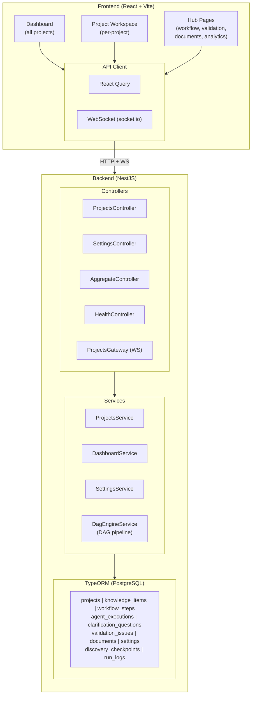

# CONTEXT.md — Full Technical Context

> Detailed technical context for the Crystallize platform

## 1. Architecture Overview



## 2. Directory Structure

```
/
├── apps/
│   ├── server/           # NestJS REST API + WebSocket gateway
│   │   └── src/
│   │       ├── agents/         # 14 agent services (discovery, research, etc.)
│   │       ├── aggregate/      # Cross-project aggregate endpoints
│   │       ├── database/       # TypeORM entities
│   │       ├── health/         # Health check endpoint
│   │       ├── llm/            # OpenAI / Groq LLM service
│   │       ├── projects/       # Project CRUD + workflow controller
│   │       ├── project-context/  # Shared Project Context service (16 domains, commits, versioning)
│   │       ├── prompts/         # Prompt Builder framework (templates, blocks, versioning)
│   │       ├── dag-engine/      # DAG workflow engine (pipeline config, parallel execution, checkpoint, retry)
│   │       ├── knowledge-graph/  # Structured KB: typed edges, graph retrieval, traceability
│   │       ├── relationships/   # Relationship graph: layers, impact, propagation, matrix
│   │       ├── realtime/       # WebSocket gateway + event services
│   │       ├── rkb/            # Knowledge base service
│   │       ├── settings/       # Pipeline defaults persistence
│   │       ├── validation/     # Deterministic output validator + schemas
│   │       ├── checkpoint/     # Discovery human-in-the-loop checkpoint
│   │       ├── run-log/        # Per-run event logging + pattern review
│   │       └── eval/           # Golden-dataset eval metrics
│   │       # NOTE: sequential `workflow/` was removed — orchestration is `dag-engine/` only.
│   └── client/           # React + Vite SPA
│       └── src/
│           ├── components/
│           │   ├── layouts/     # AppLayout (sidebar + header)
│           │   ├── projects/    # Project tab components
│           │   ├── ui/          # ShadCN/ui components
│           │   └── theme-*      # Theme provider + toggle
│           ├── hooks/           # Custom hooks (socket, toast, mobile)
│           ├── lib/             # API helpers, constants, types
│           └── pages/           # Route pages
└── lib/
    ├── pipeline-config/   # Shared pipeline stages, agent keys, display names, document types (client + server)
    ├── shared-types/      # Shared DTOs: dashboard, DAG wire statuses (client + server)
    ├── api-client-react/  # Orval-generated React Query hooks (client only)
    └── db/                # Legacy Drizzle scaffold — unused (TypeORM is SoT); do not depend on
```

## 3. Frontend Routes

| Path            | Component               | Auth | Description                                                        |
| --------------- | ----------------------- | ---- | ------------------------------------------------------------------ |
| `/`             | Redirect → `/dashboard` | None | Entry redirect                                                     |
| `/dashboard`    | `DashboardPage`         | None | All projects card grid, stats, new project button                  |
| `/projects/new` | `NewProjectPage`        | None | Submit software idea form                                          |
| `/projects/:id` | `ProjectWorkspace`      | None | Per-project workspace with tabs (workflow, executions, docs, relationships, etc.) |
| `/ai-workflow`  | `AiWorkflowPage`        | None | Pipeline blueprint, agent descriptions                             |
| `/validation`   | `ValidationHubPage`     | None | Cross-project validation issues                                    |
| `/documents`    | `DocumentsHubPage`      | None | All generated documents                                            |
| `/analytics`    | `AnalyticsPage`         | None | Token usage, agent performance                                     |
| `/settings`     | `SettingsPage`          | None | LLM providers, pipeline defaults                                   |

### Project Workspace Tabs

| Tab            | Component          | Purpose                      |
| -------------- | ------------------ | ---------------------------- |
| Workflow       | `TreePipelineView` | 21-stage visual DAG pipeline (4-quadrant starburst star-network, dark midnight cyber grid, zero overlap, fixed position with page scroll passthrough) + integrated DAG execution controls |
| Execution Logs | `TabExecutions`    | Per-agent execution history  |
| Documents      | `TabDocument`      | Generated document preview   |
| Validation     | `TabValidation`    | Validation issues            |
| Questions      | `TabQuestions`     | Clarification Q&A            |
| Requirements   | `TabRequirements`  | Functional requirements list |
| Versions       | (placeholder)      | Document version history     |

## 4. Backend API Routes

All routes prefixed with `/api` (set in `main.ts`).

### Projects Controller (`/api/projects`)

| Method | Path                                     | Purpose                                                                                 |
| ------ | ---------------------------------------- | --------------------------------------------------------------------------------------- |
| GET    | `/`                                      | List all projects                                                                       |
| POST   | `/`                                      | Create new project                                                                      |
| GET    | `/:id`                                   | Get project by ID                                                                       |
| DELETE | `/:id`                                   | Delete project                                                                          |
| POST   | `/:id/start`                             | Start/resume workflow                                                                   |
| POST   | `/:id/recompile`                         | Recompile document (creates a new version for the compiled document only)               |
| POST   | `/:id/cancel`                            | Cancel running workflow                                                                 |
| POST   | `/:id/pause`                             | Pause running workflow (graceful, stage completes first)                                |
| POST   | `/:id/regenerate/:agentKey`              | Re-run from a specific agent onwards (new version per regenerated document)             |
| GET    | `/:id/progress`                          | Get workflow step progress                                                              |
| GET    | `/:id/knowledge`                         | Get all knowledge items                                                                 |
| GET    | `/:id/knowledge/by-agent/:agentKey`      | Get knowledge items for a specific agent                                                |
| GET    | `/:id/requirements`                      | Get functional requirements                                                             |
| GET    | `/:id/assumptions`                       | Get assumptions                                                                         |
| GET    | `/:id/questions`                         | Get clarification questions                                                             |
| POST   | `/:id/questions/:questionId/answer`      | Submit answer to question                                                               |
| GET    | `/:id/discovery-confirmation`            | Get the discovery checkpoint (interpretation + blocking questions)                      |
| POST   | `/:id/discovery-confirmation`            | Confirm/edit the discovery interpretation, then resume pipeline                         |
| GET    | `/:id/run-logs`                          | Per-run pipeline events (retries, parse/validation failures, padding, low-confidence)   |
| POST   | `/:id/gap-analysis/run`                  | Start the Gap Analysis engine (single-pass analyze; no document changes during analysis) |
| GET    | `/:id/gap-analysis`                      | Live run status (`activeRun` phase) + pending per-gap proposals + analysis history + `appliedFindings`/`applyingFindings` |
| POST   | `/:id/gap-analysis/proposals/:id/apply`  | Apply one gap (targeted section-level patch; updates the existing document version in place, no new version) |
| POST   | `/:id/gap-analysis/proposals/:id/reject` | Ignore one gap (no changes; run completes when all proposals resolved)                   |
| POST   | `/:id/gap-analysis/proposals/apply-all`  | Apply all pending gaps, then complete the run                                           |
| POST   | `/:id/gap-analysis/findings/:findingKey/apply` | Apply an actionable finding directly from the findings list (key is `iteration:index`; updates in place, no new version) |
| GET    | `/:id/executions`                        | Get agent executions                                                                    |
| GET    | `/:id/validation`                        | Get validation issues                                                                   |
| GET    | `/:id/document`                          | Get compiled document                                                                   |
| GET    | `/:id/documents`                         | List all documents by type                                                              |
| GET    | `/:id/documents/:documentType`           | Get document by type (e.g., FRD_DOCUMENT, USER_STORIES_DOCUMENT)                        |
| GET    | `/:id/stats`                             | Get project stats                                                                       |
| GET    | `/:id/dashboard`                         | Get full dashboard snapshot                                                             |

### Settings Controller (`/api/settings`)

| Method | Path        | Purpose                  |
| ------ | ----------- | ------------------------ |
| GET    | `/pipeline` | Get pipeline defaults    |
| PUT    | `/pipeline` | Update pipeline defaults |

### Project Context Controller (`/api/projects/:projectId/context`)

See `PROJECT_CONTEXT.md` for the full design (16 domains, commit/versioning model, conflict rules).

| Method | Path | Purpose |
| ------ | ---- | ------- |
| GET | `/` | Domain-filtered live context view (`?domains=a,b&includeSuperseded=true&updatedSince=ISO`) |
| GET | `/digest` | Consumer-specific digest for prompt building (`?consumerAgent=x`) |
| GET | `/domains` | Supported domains + per-domain counts |
| GET | `/items/:domain/:externalId` | Single item (`?version=N` reads a snapshot) |
| GET | `/versions` | Snapshot history (`?itemId=` or `?domain=&externalId=`) |
| GET | `/commits` | Append-only commit log (`?limit=&before=`) |
| POST | `/commits` | Atomic commit: create/upsert/delete/supersede with optimistic locking |
| POST | `/backfill` | Idempotent seed of context items from legacy `knowledge_items` |
| GET | `/stream` | SSE delta stream for live context updates |

### Artifacts Controller (`/api/artifacts`)

| Method | Path | Purpose |
| ------ | ---- | ------- |
| GET | `/` | List generated artifacts (BUILD_PROMPT_DOCUMENT per project) with `htmlUrl` + `websiteUrl` |
| GET | `/:id/html` | Standalone HTML: `?mode=document` (markdown render) or `?mode=website` (multi-page clickable concept site) |
| POST | `/generate` | Create/refresh the build-prompt artifact for a project `{ projectId }` |
| POST | `/:id/regenerate` | Rebuild a single artifact in place without re-running downstream stages |

### Aggregate Controller (`/api/aggregate`)

### Prompts Controller (`/api/prompts`)

### DAG Engine Controller (`/api/dag` + `/api/projects/:projectId/dag`)

### Knowledge Base Controller (`/api/projects/:projectId/kb`)

### Relationships Controller (`/api/projects/:projectId/relationships`)

See `RELATIONSHIP_GRAPH.md` for the full design (layered graph, impact analysis, propagation).

| Method | Path | Purpose |
| ------ | ---- | ------- |
| GET | `/types` | Layers, domain→layer mapping, relation taxonomy |
| GET | `/graph` | Layered graph payload for visualization |
| GET | `/:itemId/trace` | Up/down traceability |
| GET | `/:itemId/impact` | Impact analysis (forward closure + docs/risks) |
| GET | `/:itemId/propagate` | Change propagation with severity |
| GET | `/matrix` | Traceability matrix + coverage gaps |
| GET | `/search` | Relationship-aware search |

See `KNOWLEDGE_BASE.md` for the full design (typed edges, graph traversal, fused retrieval).

| Method | Path | Purpose |
| ------ | ---- | ------- |
| POST | `/edges` | Assert typed edges between knowledge items |
| DELETE | `/edges/:edgeId` | Remove an edge |
| GET | `/edges` | Query edges by source/target/relation |
| GET | `/graph` | Full knowledge graph (nodes + edges) |
| GET | `/neighbors/:itemId` | BFS neighborhood (relation + depth filters) |
| GET | `/trace/:itemId` | Traceability: referencing + referenced items |
| GET | `/retrieve` | Fused retrieval (structured + keyword + graph + semantic) |
| POST | `/render-document` | KB source snapshot for a document type |

See `DAG_WORKFLOW.md` for the full design (parallel execution, retries, checkpoints, resume).

| Method | Path | Purpose |
| ------ | ---- | ------- |
| GET | `/dag/definitions` | List DAG definitions |
| GET | `/dag/definitions/:key` | Definition + generated plan |
| GET | `/dag/definitions/:key/plan` | Execution plan (parallel layers) |
| POST | `/projects/:projectId/dag/run` | Start a DAG run |
| GET | `/projects/:projectId/dag/state` | Latest run state for a project |
| POST | `/dag/runs/:runId/pause` | Graceful pause |
| POST | `/dag/runs/:runId/resume` | Resume from failed node |
| POST | `/dag/runs/:runId/nodes/:nodeKey/retry` | Re-run node + descendants |
| POST | `/dag/runs/:runId/nodes/:nodeKey/skip` | Skip optional node |
| POST | `/dag/runs/:runId/nodes/:nodeKey/approve` | Approve checkpoint |

See `PROMPT_BUILDER.md` for the full design (templates, blocks, versioning, few-shot).

| Method | Path | Purpose |
| ------ | ---- | ------- |
| GET | `/` | List registered prompt templates + computed versions |
| GET | `/:key` | Full template source + version details |
| POST | `/preview` | Render a template with sample vars (`{key, vars}`), no LLM call |
| POST | `/snapshot` | Persist current templates into `prompt_templates`/`prompt_versions` (idempotent) |

| Method | Path                | Purpose                                                                                                |
| ------ | ------------------- | ------------------------------------------------------------------------------------------------------ |
| GET    | `/requirements`     | All requirements across projects                                                                       |
| GET    | `/validation`       | All validation issues across projects                                                                  |
| GET    | `/documents`        | All documents across projects                                                                          |
| GET    | `/analytics`        | Cross-project analytics                                                                                |
| GET    | `/workflow`         | Workflow overview across projects                                                                      |
| GET    | `/run-log-patterns` | Cross-project run-log pattern summary (?days=N) — retries, failures, padding, low-confidence per agent |

### Health Controller (`/api`)

| Method | Path       | Purpose      |
| ------ | ---------- | ------------ |
| GET    | `/healthz` | Health check |

## 5. WebSocket Events

Namespace: `/projects`

Event names use **dotted** Socket.IO names (not camelCase):

| Event               | Direction       | Payload                           | Description           |
| ------------------- | --------------- | --------------------------------- | --------------------- |
| `join`              | Client → Server | `{ projectId }`                   | Join project room     |
| `leave`             | Client → Server | `{ projectId }`                   | Leave project room    |
| `agent.activity`    | Server → Client | `{ projectId, agentKey, phases }` | Agent progress update |
| `knowledge.created` | Server → Client | `{ projectId, items }`            | New knowledge items   |
| `project.status`    | Server → Client | `{ projectId, status, currentStage }` | Project status change |
| `stage.updated`     | Server → Client | `{ projectId, stage, status, … }` | Workflow step update  |
| `execution.updated` | Server → Client | `{ projectId, executionId, … }`   | Agent execution update |
| `dashboard.snapshot`| Server → Client | dashboard snapshot object         | Full dashboard update |
| `gap.analysis.progress` | Server → Client | `{ projectId, activeRun }`    | Gap analysis phase    |
| `context.updated`   | Server → Client | `{ projectId, domain, externalId, version }` | Project Context item changed (planned; SSE `/context/stream` is live) |
| `dag.node.updated`   | Server → Client | `{ projectId, runId, nodeKey, status, retryCount, error, at }` | DAG node state change |
| `dag.run.updated`    | Server → Client | `{ projectId, runId, status, currentLevel, currentNodeKey, at }` | DAG run state change |

## 6. Environment Variables

### Required

| Variable       | Default | Description                  |
| -------------- | ------- | ---------------------------- |
| `DATABASE_URL` | —       | PostgreSQL connection string |
| `PORT`         | `3000`  | Backend server port          |

### LLM Configuration

| Variable         | Default                   | Description        |
| ---------------- | ------------------------- | ------------------ |
| `LLM_PROVIDER`   | `openai`                  | `openai`, `groq`, `ollama`, `custom`, or aliases (`anthropic`, `openrouter`, …) |
| `LLM_MODEL`      | provider default          | Model id used for all agents (unless tier overrides) |
| `LLM_API_KEY`    | —                         | Credential (optional for ollama; required for openai/groq) |
| `LLM_BASE_URL`   | provider default          | OpenAI-compatible base URL (required for custom/anthropic gateways) |
| `LLM_MODEL_HIGH` / `LLM_MODEL_STANDARD` / `LLM_MODEL_FAST` | — | Per-tier model overrides for agents |
| `LLM_MAX_TOKENS` / `AGENT_MAX_TOKENS` | — | Optional global output token cap |
| `LLM_TIMEOUT_MS` | `120000` | Per-request LLM HTTP timeout |

Legacy keys (`OPENAI_API_KEY`, `GROQ_*`, `OLLAMA_*`, `CUSTOM_LLM_*`) still work as fallbacks when the generic `LLM_*` vars are unset.

### Security / Runtime

| Variable   | Default       | Description                   |
| ---------- | ------------- | ----------------------------- |
| `NODE_ENV` | `development` | `development` or `production` |
| `CORS_ORIGINS` | local Vite/backend ports | Comma-separated allowed origins (`*` = all) |
| `REQUIRE_AUTH` | — | Set `true` to require API key in non-production |
| `API_KEY` | — | Shared API key (`Authorization: Bearer` or `X-Api-Key`) |
| `DATABASE_SSL_REJECT_UNAUTHORIZED` | `false` | When `true` in production, enforce DB TLS cert checks |
| `HEAVY_RATE_LIMIT_WINDOW_MS` | `60000` | Rate-limit window for expensive POST routes |
| `HEAVY_RATE_LIMIT_MAX` | `10` | Max heavy POSTs per IP per window |
| `SKIP_VALIDATION` | `false` | Set `true` to bypass agent validation/retries |
| `AGENT_VALIDATION_MAX_RETRIES` | `2` | Validation retry count when not skipped |
| `DAG_CONCURRENCY` | `5` | Parallel DAG node concurrency (forced to `1` for ollama) |
| `GAP_ANALYSIS_TIMEOUT_MS` | `900000` | Gap-analysis wait timeout |

### Foundation flags

| Variable | Default | Description |
| -------- | ------- | ----------- |
| `FOUNDATION_CANONICAL_WRITE` | `true` | Canonical dual-write from agent output |
| `FOUNDATION_QUALITY_PER_STAGE` | `true` | Per-stage quality evaluation |
| `FOUNDATION_COMPILER_AUTO` | `false` | Auto-compile documents at compilation node |
| `FOUNDATION_AUTO_QUALITY` | `true` | Full project quality run at pipeline completion |

### Frontend (Vite)

| Variable | Default | Description |
| -------- | ------- | ----------- |
| `VITE_API_PROXY` | `http://localhost:3000` | Dev proxy target for `/api` + `/socket.io` |
| `VITE_API_URL` | — | Absolute API origin when not same-origin |
| `VITE_API_KEY` | — | Sent as Bearer + `X-Api-Key` when backend auth is on |
| `VITE_SOCKET_URL` | `window.location.origin` | Socket.IO origin |
| `PORT` | `5173` | Vite dev server port |
| `BASE_PATH` | `/` | SPA base path |

See also root `.env.example` and `apps/client/.env.example`.

## 7. Known Issues & Pitfalls

1. **Theme toggle race condition** — fixed: header toggle now saves to backend, Settings page no longer overrides `next-themes` state on load
2. **Orval codegen staleness** — `lib/api-client-react` types can drift from backend controllers; regenerate with `pnpm codegen`
3. **TypeORM synchronize** — auto-creates/alters tables in development; never use in production without migrations
4. **Groq rate limits** — `GROQ_INPUT_CHAR_BUDGET` is 28k chars; long ideas may need truncation
5. **WebSocket reconnection** — frontend falls back to HTTP polling when WebSocket disconnects; no user-visible error
6. **`lib/db` Drizzle schema** — reference-only, not used by backend (backend uses TypeORM entities); can drift
7. **Custom provider thinking mode** — Anthropic Console gateways in thinking mode reject
   `tool_choice` with a 400; the runtime detects this and uses `json_object` + an in-prompt
   schema hint (`buildSchemaHint`). The schema hint must list the agent's real top-level keys
   from `schema.properties` — never `Object.keys(schema)` (that yields `type`/`properties`/`required`).
8. **Model changes** — when switching providers/models, update `apps/server/src/llm/model-compat.ts`
   and run `pnpm --filter @workspace/server check:schema` to verify every agent schema is registered and complete.
9. **`SKIP_VALIDATION`** — env values are strings; only the literal `"true"` disables validation
   (`"false"` must not be treated as truthy).
10. **Discovery checkpoint status** — after discovery, project must stay `WAITING_FOR_USER` (not
    `DISCOVERING`) so `confirmDiscovery` → `start()` is allowed; DAG pause mapping uses
    `CHECKPOINT_PROJECT_STATUS`.
11. **RKB `source` format** — items are stored as `agentKey` or `agentKey::category`; context digest
    matches on the agentKey prefix before `::`.

## 8. Technology Decisions

| Decision                | Rationale                                                                |
| ----------------------- | ------------------------------------------------------------------------ |
| NestJS (backend)        | Enterprise-grade, built-in DI, WebSocket support, TypeScript-native      |
| React + Vite (frontend) | Fast dev server, React ecosystem, ShadCN/ui compatibility                |
| TypeORM (backend)       | Mature PostgreSQL ORM, entity decorator pattern, synchronize for dev     |
| Drizzle (lib/db)        | Reference schema, not actively used; kept for potential future migration |
| React Query             | Server-state management, automatic caching, query invalidation           |
| ShadCN/ui               | Accessible, themeable components built on Radix primitives               |
| Tailwind CSS v4         | Utility-first styling, CSS variable theming                              |
| Socket.IO               | Real-time agent activity streaming with fallback to polling              |
| pnpm workspaces         | Efficient monorepo dependency management                                 |
| Nx                      | Build caching, affected commands (not fully leveraged)                   |

## 9. Conventions

- **Components**: PascalCase, colocated in `components/` or `pages/`
- **Hooks**: `use` prefix, in `hooks/`
- **Backend services**: `*.service.ts`, one per domain
- **Backend controllers**: RESTful, nest under resource name
- **Backend entities**: TypeORM decorators, snake_case columns
- **CSS classes**: Tailwind utilities, semantic color tokens (`bg-card`, `text-foreground`)
- **API responses**: JSON, consistent shape with `id`, `createdAt`, `updatedAt`
- **Error handling**: NestJS `NotFoundException`, `BadRequestException`
