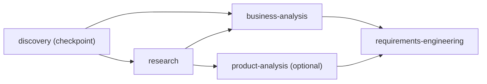

# DAG_WORKFLOW.md — DAG-Based Workflow Engine

> Parallel, dependency-driven execution engine for the Crystallize AI Requirements
> Engineering Platform. Replaces the purely sequential pipeline with a DAG where
> independent agents run concurrently and state is persisted per node and per run.

## Status

| Component | Status |
|---|---|
| Graph algorithms (layering, cycles, plan) | **done** |
| DAG definition for the 22-stage pipeline | **done** |
| Node executor registry (agent integration point) | **done** |
| Execution engine (parallel, retry, skip, checkpoint, resume, pause) | **done** |
| Persistence (definitions, runs, node runs) | **done** |
| REST API (`/api/dag/...`) | **done** |
| Sanity DAG + demo executors (smoke test without LLM keys) | **done** |
| Unit specs (graph + engine) | **done** |
| Wiring into `AppModule` | **done** |
| WebSocket streaming (`dag.node.updated` / `dag.run.updated`) | **done** |
| Real agent adapters registered for the 22 pipeline nodes | **done** |

## Architecture

```
Definitions (static)                  Runtime (DagEngineModule)
  pipeline.dag.ts   ──────────────►   DagEngineService
  (nodes + edges)                       │
                                        ├─ generatePlan()  → layers
                                        ├─ executeFromLevel()  (parallel batches)
                                        ├─ retry / skip / checkpoint
                                        └─ persist state
                                              │
NodeExecutorRegistry ◄───────────────────────┘
  nodeKey → (ctx) => Promise<Result>          │ (agent adapters registered here)
                                              ▼
                                   PostgreSQL (TypeORM)
                                   workflow_dag_definitions
                                   workflow_dag_runs
                                   workflow_dag_node_runs
```

### Components

| Component | Purpose |
|---|---|
| `graph.ts` | Pure DAG algorithms: `analyzeDag` (Kahn layering + cycle detection), `generatePlan`, `descendantsOf`, `levelOf`. No I/O. |
| `pipeline.dag.ts` | Declarative DAG for the real 22-stage pipeline + a `sanity` demo DAG. Edges encode the `AGENT_DIGEST_CONFIG` dependency contract. |
| `node-executor.registry.ts` | `NodeExecutorRegistry`: map of node key → executor function. The integration point where real agent adapters (`(ctx) => discoveryService.run(ctx)`) get registered. |
| `dag-engine.service.ts` | The engine: run lifecycle, parallel level execution, retries, skip cascades, checkpoint pause/approve, resume from failed node, pause/resume, state persistence. |
| `dag-engine.controller.ts` | REST API. |
| Entities | `workflow_dag_definitions`, `workflow_dag_runs`, `workflow_dag_node_runs`. |

## Database Schema

### `workflow_dag_definitions`
Audit copy of each DAG definition (upserted on first run).

| Column | Type | Notes |
|---|---|---|
| `id` | uuid PK | |
| `key` | varchar(100) | Unique, e.g. `crystallize-pipeline` |
| `name` | varchar(200) | |
| `definition_json` | text | Serialized `WorkflowDagDefinition` |
| `created_at` / `updated_at` | timestamptz | |

### `workflow_dag_runs`
One row per execution of a definition for a project.

| Column | Type | Notes |
|---|---|---|
| `id` | uuid PK | |
| `project_id` | uuid | Indexed |
| `definition_key` | varchar(100) | |
| `status` | varchar(32) | `PENDING` \| `RUNNING` \| `PAUSED` \| `WAITING_APPROVAL` \| `COMPLETED` \| `FAILED` \| `CANCELLED` |
| `current_level` | int | Last executed level |
| `current_node_key` | varchar(100) | Checkpoint/failed node |
| `error` | text | Failure summary |
| `created_at` / `updated_at` | timestamptz | |

### `workflow_dag_node_runs`
Per-node state inside a run.

| Column | Type | Notes |
|---|---|---|
| `id` | uuid PK | |
| `run_id` | uuid | Indexed |
| `node_key` | varchar(100) | |
| `status` | varchar(32) | `PENDING` \| `RUNNING` \| `COMPLETED` \| `FAILED` \| `SKIPPED` \| `WAITING_APPROVAL` \| `BLOCKED` |
| `depends_on` | text[] | Direct dependencies |
| `required` | boolean | Optional nodes can be skipped |
| `checkpoint` | boolean | Requires human approval |
| `retry_count` / `max_retries` | int | Attempt bookkeeping |
| `timeout_ms` | int nullable | Per-node timeout |
| `started_at` / `completed_at` | timestamptz | |
| `error` | text | Last error |
| `output_json` | text | Serialized node output |

## Execution Algorithm

1. **Plan** — `generatePlan(def)` runs Kahn's algorithm: nodes with in-degree 0
   form a level; removing them exposes the next level. Nodes inside a level are
   independent → executed in parallel. Cycles throw before execution.
2. **Level loop** — `executeFromLevel` walks levels top-to-bottom. Before each
   level it re-reads the run; if `PAUSED`/`CANCELLED` it stops gracefully
   (in-flight nodes complete first — matching existing pause semantics).
3. **Dependency resolution** — for each node in a level:
   - all deps `COMPLETED` → eligible (set `RUNNING`, execute)
   - any dep `FAILED`/`BLOCKED`/`SKIPPED` → required node becomes `BLOCKED` (fails the run); optional node becomes `SKIPPED`
4. **Parallel execution** — eligible nodes run via `Promise.all` in batches of
   `concurrency` (default 3).
5. **Retry** — each node runs up to `1 + retries` attempts with backoff-free
   re-invocation; success flips `COMPLETED` (or `WAITING_APPROVAL` for
   checkpoints); exhaustion flips `FAILED`.
6. **Checkpoints** — a successful checkpoint node pauses the run at
   `WAITING_APPROVAL`; the run resumes only after `approveCheckpoint`.
7. **Failure** — a required failure sets the run to `FAILED` (with
   `current_node_key` + error) and stops; downstream nodes remain `PENDING`.
8. **Resume** — `resume` resets nodes from the failed node's level onward
   (preserving deliberate `SKIPPED` nodes) and re-executes from that level.
9. **Skip** — `skipNode` marks an optional node `SKIPPED`; optional dependents
   cascade to `SKIPPED` when re-evaluated.

## TypeScript Interfaces (`dag-engine/types.ts`)

```ts
interface WorkflowDagDefinition { key; name; nodes: DagNodeDef[]; edges: DagEdgeDef[] }
interface DagNodeDef { key; label?; agentKey?; optional?; checkpoint?; retries?; timeoutMs? }
interface DagEdgeDef { from; to }
interface ExecutionPlan { definitionKey; layers: string[][]; nodeMeta: Record<string, NodeMeta> }
type DagNodeStatus = 'PENDING' | 'RUNNING' | 'COMPLETED' | 'FAILED' | 'SKIPPED' | 'WAITING_APPROVAL' | 'BLOCKED'
type DagRunStatus = 'PENDING' | 'RUNNING' | 'PAUSED' | 'WAITING_APPROVAL' | 'COMPLETED' | 'FAILED' | 'CANCELLED'
interface NodeExecutionContext { runId; projectId; definitionKey; nodeKey; attempt; deps; signal? }
interface NodeExecutionResult { success; output?; error? }
type NodeExecutor = (ctx: NodeExecutionContext) => Promise<NodeExecutionResult>
```

## APIs

### Definitions & planning

| Method | Path | Purpose |
|---|---|---|
| `GET` | `/api/dag/definitions` | List DAGs (keys, names, node/edge counts) |
| `GET` | `/api/dag/definitions/:key` | Definition + generated plan |
| `GET` | `/api/dag/definitions/:key/plan` | Execution plan (parallel layers + node metadata) |
| `GET` | `/api/dag/definitions/:key/inspect` | Graph analysis (layers, order, cycles) |

### Runs (project-scoped)

| Method | Path | Purpose |
|---|---|---|
| `POST` | `/api/projects/:projectId/dag/run` | Start a run (`{ definitionKey? }`) |
| `GET` | `/api/projects/:projectId/dag/state` | Latest run + node states for a project |
| `GET` | `/api/dag/runs/:runId` | Run + node states |
| `POST` | `/api/dag/runs/:runId/pause` | Graceful pause (in-flight completes) |
| `POST` | `/api/dag/runs/:runId/resume` | Resume (re-runs failed node + descendants) |
| `POST` | `/api/dag/runs/:runId/nodes/:nodeKey/retry` | Re-run one node + descendants |
| `POST` | `/api/dag/runs/:runId/nodes/:nodeKey/skip` | Skip an optional node |
| `POST` | `/api/dag/runs/:runId/nodes/:nodeKey/approve` | Approve a checkpoint node |

## Example Execution

`sanity` DAG:



Layers: `[discovery] → [research] → [business-analysis, product-analysis] → [requirements-engineering]`.

1. `POST /api/projects/123/dag/run { "definitionKey": "sanity" }`
2. `sanity-discovery` runs → `WAITING_APPROVAL`, run `WAITING_APPROVAL` (demo output persisted).
3. `POST /api/dag/runs/<runId>/nodes/sanity-discovery/approve`
4. `sanity-research` runs alone; then `sanity-business-analysis` and `sanity-product-analysis` run **in parallel**.
5. `sanity-requirements-engineering` runs with `deps` containing both outputs.
6. Run `COMPLETED`.

The real `crystallize-pipeline` DAG executes the six document generators
(`frd`, `user-stories`, `tech-arch`, `db-design`, `api-spec`, `sow`) in one
parallel layer after compilation, then `gap-analysis` after all six.

## Integration With Agents

Real adapters are implemented in `dag-agent-executor.adapter.ts`:
- Every `crystallize-pipeline` node is registered with an executor that builds
  the `AgentContext` (project name/idea/domain + shared knowledge items +
  answered questions + per-consumer `AGENT_DIGEST_CONFIG` digest) and runs the
  corresponding agent service.
- Results are persisted through `RkbService` exactly like the sequential
  workflow (`saveKnowledgeItems`, `saveQuestions`, `saveValidationIssues`,
  `saveDocument` with the correct document type).
- `gap-analysis` triggers `GapAnalysisService.startRun()` and completes when
  the active run reaches `COMPLETED`/`AWAITING_REVIEW` (proposal review stays
  on the existing gap-analysis endpoints).
- The `sanity` DAG keeps its own `sanity-*` executors (no LLM keys needed),
  so the smoke path never collides with real agents.

## WebSocket Events

`DagRealtimeBridge` forwards every persisted state change to the project room:

| Event | Payload |
|---|---|
| `dag.node.updated` | `{ projectId, runId, nodeKey, status, retryCount, error, at }` |
| `dag.run.updated` | `{ projectId, runId, status, currentLevel, currentNodeKey, at }` |

## Future Work

- Per-node concurrency tuning + queue (backpressure) for long pipelines.
- Abort signals for true mid-node cancellation (pause currently completes in-flight nodes).
- Golden-eval comparison of sequential vs DAG execution output.
- Project status/`workflow_steps` mirroring so the UI can run either engine interchangeably.
