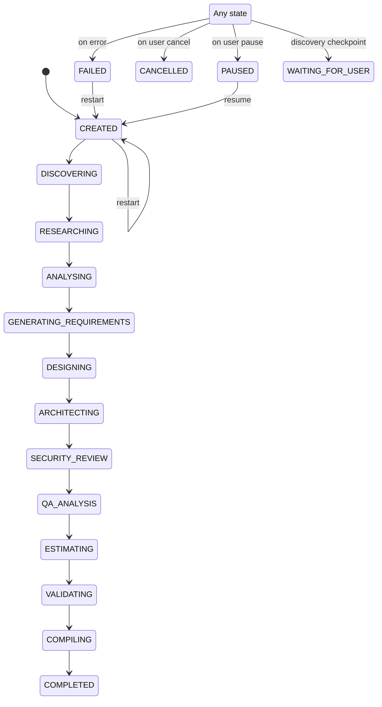

# WORKFLOW_RULES.md — Pipeline State Machine & Agent Orchestration

> The 23-stage sequential pipeline (15 structured agents incl. compilation + 7 document stages + gap-analysis review) that processes software ideas into requirements documents.

## Pipeline Stages

**Total stages:** 23 (15 structured agents incl. compilation + 7 generated documents + gap-analysis review)

## State Machine

### Workflow Step Status

| Status      | Meaning                                                 |
| ----------- | ------------------------------------------------------- |
| `QUEUED`    | Waiting for previous step to complete                   |
| `RUNNING`   | Currently executing agent                               |
| `COMPLETED` | Agent finished successfully                             |
| `FAILED`    | Agent failed with error                                 |
| `PAUSED`    | Pipeline paused by user (current stage completes first) |

## Agent Mapping

| Stage                    | Agent Service                 | Agent Key                  | Purpose                                   |
| ------------------------ | ----------------------------- | -------------------------- | ----------------------------------------- |
| DISCOVERY                | `DiscoveryService`            | `discovery`                | Analyze idea, extract domain context      |
| RESEARCH                 | `ResearchService`             | `research`                 | Domain research, feasibility              |
| BUSINESS_ANALYSIS        | `BusinessAnalystService`      | `business-analysis`        | Business requirements                     |
| PRODUCT_ANALYSIS         | `ProductManagerService`       | `product-analysis`         | Feature sets, user stories                |
| REQUIREMENTS_ENGINEERING | `RequirementsEngineerService` | `requirements-engineering` | Formal requirements                       |
| UX_DESIGN                | `UxService`                   | `ux-design`                | User flows, wireframes                    |
| DATA_ARCHITECTURE        | `DataArchitectService`        | `data-architecture`        | Data models, schemas                      |
| AI_ARCHITECTURE          | `AiArchitectService`          | `ai-architecture`          | AI/ML components                          |
| SOLUTION_ARCHITECTURE    | `SolutionArchitectService`    | `solution-architecture`    | System architecture                       |
| SECURITY_REVIEW          | `SecurityService`             | `security-review`          | Threat modeling, security                 |
| QA_PLANNING              | `QaService`                   | `qa-planning`              | Test strategy                             |
| ESTIMATION               | `EstimationService`           | `estimation`               | Effort estimates                          |
| VALIDATION               | `CriticService`               | `validation`               | Quality review                            |
| DEBATE                   | `DebateService`               | `debate`                   | Multi-agent debate on validation findings |
| COMPILATION              | `CompilerService`             | `compilation`              | Final document assembly                   |
| FRD_GENERATION           | `FrdService`                  | `frd`                      | Functional Requirements Document          |
| USER_STORIES_GENERATION  | `UserStoriesService`          | `user-stories`             | User Stories & Acceptance Criteria        |
| TECH_ARCH_GENERATION     | `TechArchService`             | `tech-arch`                | Technical Architecture (HLD)              |
| DB_DESIGN_GENERATION     | `DbDesignService`             | `db-design`                | Database Design & Schema                  |
| API_SPEC_GENERATION      | `ApiSpecService`              | `api-spec`                 | OpenAPI/Swagger Specification             |
| SOW_GENERATION           | `SowService`                  | `sow`                      | Client-facing Scope of Work (feature-by-feature) |

**Gap Analysis stage:** after the 7 document generators (6 customer documents + build-prompt), the pipeline runs the Gap Analysis
engine (`GAP_ANALYSIS` stage). The engine performs a **single analysis pass** (analyze all
artifacts, compare against scope, produce one proposal per gap — no document is modified during
analysis), then pauses at `GAP_ANALYSIS_REVIEW` with PENDING proposals. The user applies or
ignores each gap in the Gap Analysis tab; applying generates a targeted section-level patch for
that document only and updates the document's existing version in place (gap analysis never
creates a new document version). After the run completes, actionable findings remain visible in
the Findings list and can still be applied directly. The engine never re-analyzes automatically —
a new run must be explicitly started. When all proposals are resolved (or the run is stopped),
the stage (and project) finalizes to `COMPLETED`. Restartable via `POST /:id/start`.

## Execution Flow

1. User submits idea via `POST /api/projects` → project created with status `CREATED`
2. User clicks "Start Analysis" → `POST /api/projects/:id/start`
3. `DagEngineService.startProject()` creates a new `WorkflowDagRun` with fresh `WorkflowDagNodeRun` records
4. Pipeline runs sequentially via `setImmediate` (fire-and-forget)
5. Each agent:
   - Sets step status to `RUNNING`
   - Creates `AgentExecution` record
   - Calls LLM via `LlmService.generateForcedStructured` (forced tool-use, per-agent JSON Schema)
   - Runs output through the deterministic validator; on failure, sends a specific correction message and retries (max 2 retries, same conversation)
   - Parses the validated structured JSON output
   - Saves knowledge items via `RkbService`
   - Emits WebSocket events via `WorkflowEventsService`
   - Sets step status to `COMPLETED` or `FAILED`
6. After DISCOVERY: pipeline pauses at `WAITING_FOR_USER` — user confirms/edits the interpretation (and answers blocking questions) via `POST /:id/discovery-confirmation`, which resumes automatically
7. After all agents: `CompilerService` assembles final markdown document
8. Project status set to `COMPLETED`

## Reliability Layer

- **Forced structured output (P0-1):** every structured agent is pinned to a single `submit_<agent>_output` tool whose input schema matches its prompt contract; the tool arguments are the entire payload (no markdown stripping).
- **Retry-with-feedback (P0-2):** `AgentRunnerService` validates each attempt (P0-3) and re-prompts with the specific failures; after 2 retries it throws `AgentValidationError`, failing the step — no partial data is saved.
- **Discovery checkpoint (P0-4):** the pipeline always pauses after Discovery (`WAITING_FOR_USER`). Blocking questions must be answered before `discovery-confirmation` accepts; the confirmed/edited interpretation is what Research and downstream agents receive.
- **Context digest (P1-1):** upstream context is trimmed per agent via `AGENT_DIGEST_CONFIG` — immediate upstream agents pass full detail, distant agents are reduced to `externalId`/`title`/one-line description.
- **Pipeline order lock (P1-2):** execution order lives in `apps/server/src/dag-engine/pipeline.config.ts`; `assertNoForwardReferences()` fails if any schema references an agent that runs later. Business Analysis runs before Product Analysis (deliberate — the PM schema references BR-* IDs).
- **Model tiering (P2-2):** per-agent tier (`LLM_MODEL_HIGH/STANDARD/FAST`) selects the model; Requirements Engineer, Solution Architect, Validation, Debate use `high`, Research/Estimation use `fast`.
- **Provider capability map:** `apps/server/src/llm/model-compat.ts` picks the structured-output
  mechanism per provider (`forced-tools` for OpenAI/Groq, `json-object` + in-prompt schema hint for
  custom/OpenAI-compatible proxies, `prompt-only` for Ollama). When switching models, update this map
  and run `pnpm --filter @workspace/server check:schema`.
- **Run logging (P2-3/P2-4):** retries, parse/validation failures, padding flags, and low-confidence items are persisted per run (with prompt/schema versions) and aggregated at `GET /api/aggregate/run-log-patterns`.

7. Project status set to `COMPLETED`

## Error Handling

- If an agent fails, the step is marked `FAILED` and `project.status` set to `FAILED`
- `errorMessage` is stored on the project entity
- User can resume from the failed stage via `POST /api/projects/:id/start`
- `DagEngineService.resumeProject()` finds the latest run and resumes it

## Re-run / Recompile

- `POST /api/projects/:id/recompile` — runs only the `CompilerService` (stage 14)
- Useful after document content changes without re-running the full pipeline

## Pause / Resume

- `POST /api/projects/:id/pause` — sets project status to `PAUSED`
  - Current running stage completes normally and saves results
  - Pipeline stops before the next stage
- `POST /api/projects/:id/start` — resumes from the last incomplete/paused stage

## Regenerate from Specific Agent

- `POST /api/projects/:id/regenerate/:agentKey` — re-runs a specific agent and all subsequent stages
  - Resets all workflow steps from that agent onward to `QUEUED`
  - Deletes all knowledge items created by those agents (by `createdBy` and `source` fields)
  - Deletes only the current rows of documents that will be regenerated; other documents and all
    version snapshots are preserved
  - Starts the workflow pipeline automatically from that stage
  - Creates a **new version only for each regenerated document** (version counter is
    per-document: FRD regenerated → FRD v2, while User Stories / Tech Arch / DB / API / Compiled
    stay on their existing versions until individually regenerated)
  - Example: `POST /api/projects/:id/regenerate/requirements-engineering`

## Document Versioning

- Version numbers are **per-document** (`project_id` + `document_type`), not per-project.
- During initial generation each document is saved exactly once as **Version 1** — no extra
  versions are created.
- A new version is only created when the user explicitly regenerates a document (regenerate
  agent or recompile) — and only for that document.
- Gap-analysis applies (proposal or findings-list Apply) update the existing document and its
  latest version **in place** — they never create a new document version.

## Real-time Updates

- `WorkflowEventsService` emits events to the WebSocket gateway during pipeline execution
- Frontend subscribes via `useProjectSocket` hook
- Events: `agent.activity`, `knowledge.created`, `project.status`, `dashboard.snapshot`, `stage.updated`
- Falls back to HTTP polling (`refetchInterval`) when WebSocket is disconnected

## Control plane (product UI)

- **Start / New Run / Restart** → `POST /api/projects/:id/start` (or `/dag/start`) → `startProject` (cancel prior runs + wipe artifacts)
- Do **not** use raw `POST .../dag/run` for product Start — that skips cancel/reset
- Discovery card gates on `WAITING_FOR_USER` (or discovery `WAITING_APPROVAL` only)
- Gap review uses `GapAnalysisTab` while project is `GAP_ANALYSIS_REVIEW`
