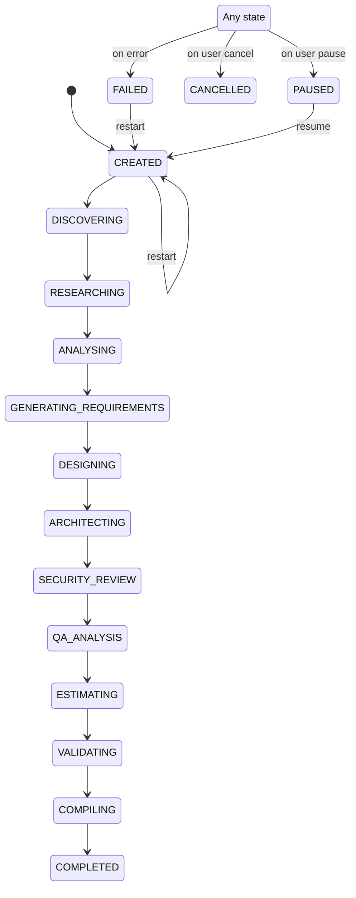

# WORKFLOW_RULES.md — Pipeline State Machine & Agent Orchestration

> The 14-agent sequential pipeline that processes software ideas into requirements documents.

## Pipeline Stages

**Total stages:** 20 (5 new document generators added)

## State Machine

### Workflow Step Status

| Status | Meaning |
|---|---|
| `QUEUED` | Waiting for previous step to complete |
| `RUNNING` | Currently executing agent |
| `COMPLETED` | Agent finished successfully |
| `FAILED` | Agent failed with error |
| `PAUSED` | Pipeline paused by user (current stage completes first) |

## Agent Mapping

| Stage | Agent Service | Agent Key | Purpose |
|---|---|---|---|
| DISCOVERY | `DiscoveryService` | `discovery` | Analyze idea, extract domain context |
| RESEARCH | `ResearchService` | `research` | Domain research, feasibility |
| BUSINESS_ANALYSIS | `BusinessAnalystService` | `business-analysis` | Business requirements |
| PRODUCT_ANALYSIS | `ProductManagerService` | `product-analysis` | Feature sets, user stories |
| REQUIREMENTS_ENGINEERING | `RequirementsEngineerService` | `requirements-engineering` | Formal requirements |
| UX_DESIGN | `UxService` | `ux-design` | User flows, wireframes |
| DATA_ARCHITECTURE | `DataArchitectService` | `data-architecture` | Data models, schemas |
| AI_ARCHITECTURE | `AiArchitectService` | `ai-architecture` | AI/ML components |
| SOLUTION_ARCHITECTURE | `SolutionArchitectService` | `solution-architecture` | System architecture |
| SECURITY_REVIEW | `SecurityService` | `security-review` | Threat modeling, security |
| QA_PLANNING | `QaService` | `qa-planning` | Test strategy |
| ESTIMATION | `EstimationService` | `estimation` | Effort estimates |
| VALIDATION | `CriticService` | `validation` | Quality review |
| DEBATE | `DebateService` | `debate` | Multi-agent debate on validation findings |
| COMPILATION | `CompilerService` | `compilation` | Final document assembly |
| FRD_GENERATION | `FrdService` | `frd` | Functional Requirements Document |
| USER_STORIES_GENERATION | `UserStoriesService` | `user-stories` | User Stories & Acceptance Criteria |
| TECH_ARCH_GENERATION | `TechArchService` | `tech-arch` | Technical Architecture (HLD) |
| DB_DESIGN_GENERATION | `DbDesignService` | `db-design` | Database Design & Schema |
| API_SPEC_GENERATION | `ApiSpecService` | `api-spec` | OpenAPI/Swagger Specification |

## Execution Flow

1. User submits idea via `POST /api/projects` → project created with status `CREATED`
2. User clicks "Start Analysis" → `POST /api/projects/:id/start`
3. `WorkflowService.start()` creates 14 `WorkflowStep` records
4. Pipeline runs sequentially via `setImmediate` (fire-and-forget)
5. Each agent:
   - Sets step status to `RUNNING`
   - Creates `AgentExecution` record
   - Calls LLM via `LlmService`
   - Parses structured JSON output
   - Saves knowledge items via `RkbService`
   - Emits WebSocket events via `WorkflowEventsService`
   - Sets step status to `COMPLETED` or `FAILED`
6. After all agents: `CompilerService` assembles final markdown document
7. Project status set to `COMPLETED`

## Error Handling

- If an agent fails, the step is marked `FAILED` and `project.status` set to `FAILED`
- `errorMessage` is stored on the project entity
- User can resume from the failed stage via `POST /api/projects/:id/start`
- `WorkflowService.prepareResume()` finds the last failed step and restarts from there

## Re-run / Recompile

- `POST /api/projects/:id/recompile` — runs only the `CompilerService` (stage 14)
- Useful after document content changes without re-running the full pipeline

## Pause / Resume

- `POST /api/projects/:id/pause` — sets project status to `PAUSED`
  - Current running stage completes normally and saves results
  - Pipeline stops before the next stage
- `POST /api/projects/:id/start` — resumes from the last incomplete/paused stage

## Regenerate from Specific Agent

- `POST /api/projects/:id/regenerate/:agentKey` — re-runs a specific agent and all subsequent stages
  - Resets all workflow steps from that agent onward to `QUEUED`
  - Deletes all knowledge items created by those agents (by `createdBy` and `source` fields)
  - Deletes the compiled document
  - Starts the workflow pipeline automatically from that stage
  - Creates a new document version on completion
  - Example: `POST /api/projects/:id/regenerate/requirements-engineering`

## Real-time Updates

- `WorkflowEventsService` emits events to the WebSocket gateway during pipeline execution
- Frontend subscribes via `useProjectSocket` hook
- Events: `agentActivity`, `knowledgeCreated`, `projectStatus`, `dashboardSnapshot`
- Falls back to HTTP polling (`refetchInterval`) when WebSocket is disconnected
